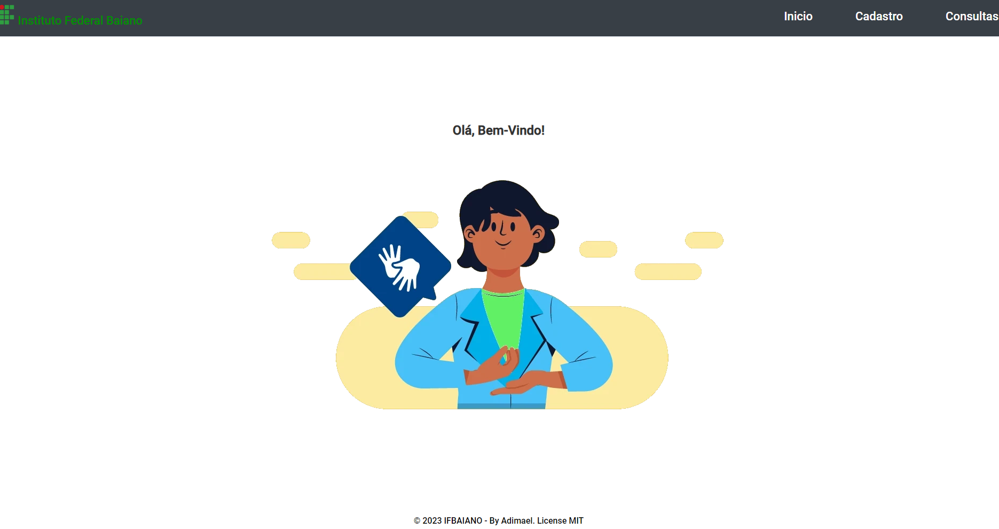
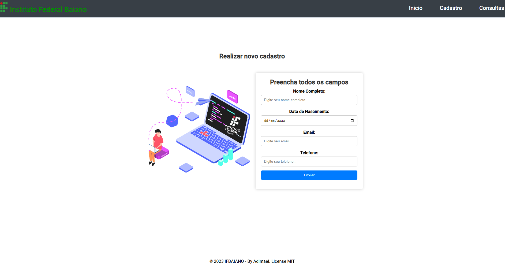
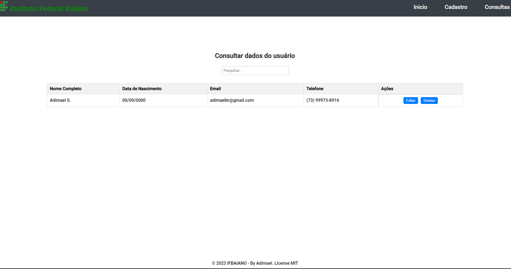
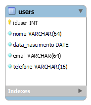

<h1 align="center">PHP MVC com URL_AMIGAVEL v0.0.1</h1>

CRUD MVC (Versão 0.0.1)

 

Definição do projeto desenvolvido para estudo de programação web com PHP, usando como arquitetura de projeto o MVC, utilizando também URL amigável.

<h3>Descrição:</h3>
	
Aplicação CRUD completo para cadastrar dados de usuários.

<h3>Como rodar o projeto (passo-a-passo):</h3>

Com o servidor XAMPP instalado, siga os passos abaixo:

1- Baixe o projeto no seu computador.
- Clone o repositório com git clone --branch=develop  https://github.com/adimael/PHP_MVC_URL_AMIGAVEL_v0.0.1.git
  
2- Extraia a pasta do projeto dentro da pasta htdocs do XAMPP.

3-Crie um banco de dados com o nome "dbsystem", e busque no diretório do projeto pelo arquivo "dbsystem.sql". Localizado em: "App/db/".

4- Importe o arquivo "dbsystem.sql" para dentro do seu banco "dbsystem" do XAMPP.

5- Agora com o APACHE e o MYSQL startados, acesse pelo browser http://localhost/

## Ou se estiver rodando o servidor PHP e MYSQL, siga as seguintes instruções:

### Comandos:

- git clone https://github.com/adimael/PHP_MVC_URL_AMIGAVEL_v0.0.1.git
- Crie um banco de dados com o nome "dbsystem", e busque no diretório do projeto pelo arquivo "dbsystem.sql". Localizado em: "App/db/".
- Importe o arquivo "dbsystem.sql" para dentro do seu banco "dbsystem"

- php -S localhost:8000 -t public/

<h3>Tecnologias utilizadas:</h3>

#### FrontEnd

#### BackEnd

<h3 align="center">
Screenshots do projeto
</h3>

<footer>

Copyright © Scrybox.dev, 2023 by Adimael

</footer>